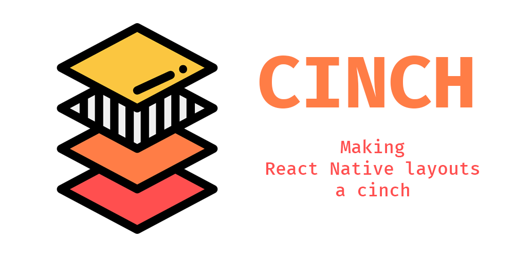

<!-- Image here -->


[](https://nodei.co/npm/cinch-layout/)

[](https://badge.fury.io/js/cinch-layout)

# Cinch

Not ready to be used.

## Get Started

### Installation

`npm install --save cinch-layout`

### Usage

```js
import Cinch from "cinch-layout";

<Cinch.Provider />;
```
